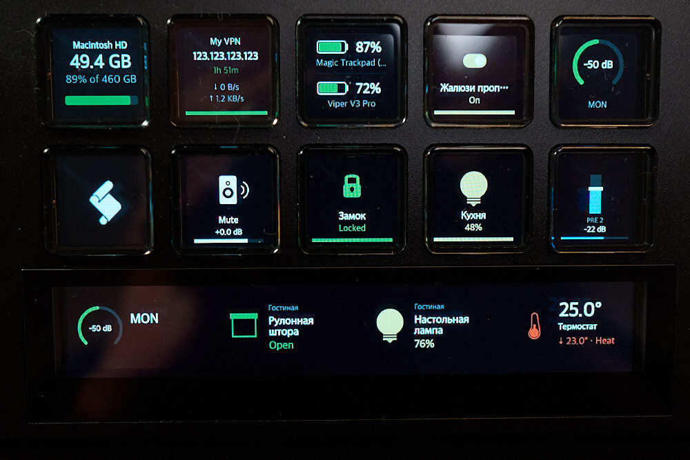
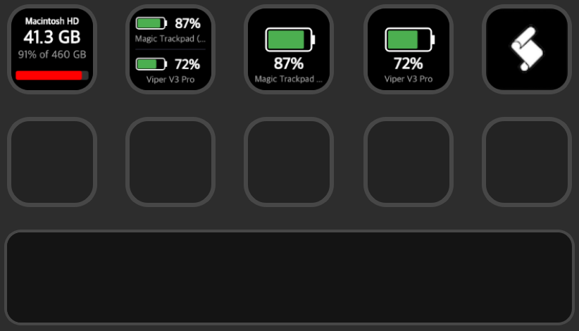
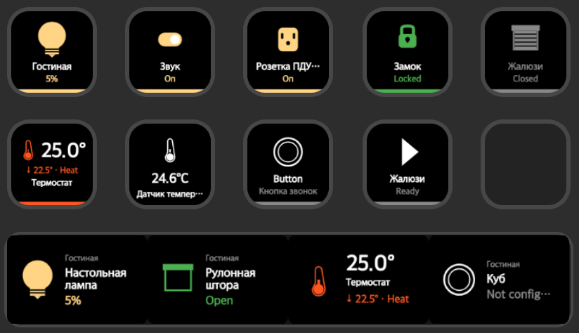
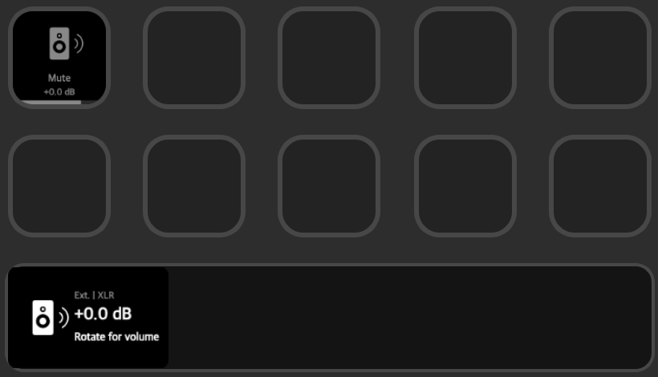
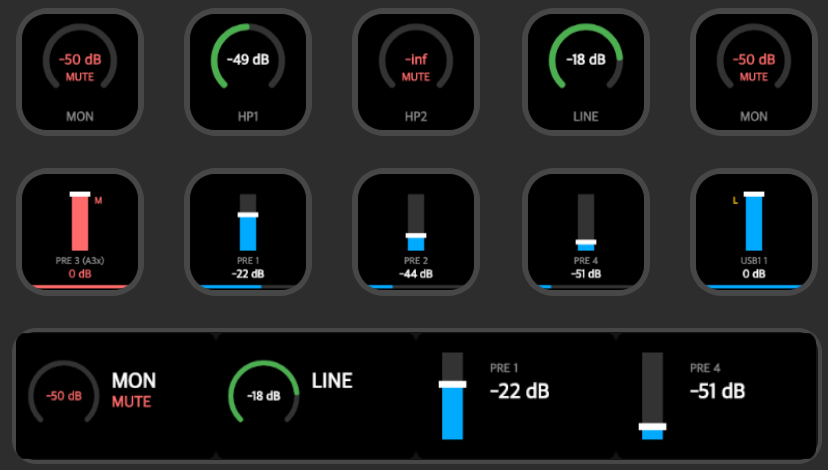

**English** | [Русский](README.ru.md)

# StreamDock Plugins

Monorepo of plugins for [StreamDock](https://www.key123.vip/en) by MiraBox (also known as AJAZZ AKP). Monitor disk usage and Bluetooth device battery, control smart home devices via Sprut.Hub, manage Adam Audio and Antelope Audio gear, and track Unifi VPN connections — all rendered as dynamic status displays on StreamDock buttons and encoder knobs. Cross-platform: macOS and Windows.

> **Bugs & feature requests** — feel free to [open an issue](https://github.com/irudoy/sd-plugins/issues)



Download plugin archives from [Releases](https://github.com/irudoy/sd-plugins/releases), extract to the plugins directory and restart StreamDock:
- **macOS:** `~/Library/Application Support/HotSpot/StreamDock/plugins/`
- **Windows:** `%APPDATA%\HotSpot\StreamDock\plugins\`

> On macOS you may need to remove the quarantine attribute:
> ```bash
> xattr -cr ~/Library/Application\ Support/HotSpot/StreamDock/plugins/com.isrudoy.*.sdPlugin
> ```

## Table of Contents

- [🔌 Plugins](#-plugins)
  - [🖥 Mac Tools](#-mac-tools)
  - [🪟 WTools](#-wtools)
  - [🌐 Unifi Network](#-unifi-network)
  - [🏠 Sprut.Hub](#-spruthub)
  - [🔊 A Control](#-a-control)
  - [🎛 Antelope Control](#-antelope-control)
- [🏗 Architecture](#-architecture)
- [⚠️ Disclaimer](#-disclaimer)

---

## 🔌 Plugins

### 🖥 Mac Tools

macOS system utilities — disk monitoring, battery tracking for Bluetooth devices, and script execution.

| | |
|---|---|
| **Platform** | macOS |
| **Actions** | 3 |
| **Knob support** | — |



<details>
<summary><b>Drive Info</b> — Keypad</summary>

Displays disk drive usage — used/free space and percentage. Correctly handles macOS APFS where `df` reports wrong values for the root partition.

</details>

<details>
<summary><b>Battery Monitor</b> — Keypad</summary>

Shows battery level for Apple Bluetooth devices (keyboard, trackpad, mouse, etc.) and Razer wireless peripherals.

> Razer device support requires **Input Monitoring** permission (System Settings → Privacy & Security → Input Monitoring).

</details>

<details>
<summary><b>Run Script</b> — Keypad</summary>

Execute AppleScript or JavaScript for Automation (JXA) on button press.

</details>

---

### 🪟 WTools

Battery monitoring for Razer wireless devices on Windows.

| | |
|---|---|
| **Platform** | Windows |
| **Actions** | 1 |
| **Knob support** | — |

<details>
<summary><b>Battery Monitor</b> — Keypad</summary>

Shows battery level for Razer wireless peripherals. Supports dual device mode with a split-view layout on a single button. Configurable polling interval (1–300s) and 24-hour device cache.

</details>

---

### 🌐 Unifi Network

Monitor Unifi Network VPN connections with color-coded status display.

| | |
|---|---|
| **Platform** | macOS, Windows |
| **Actions** | 1 |
| **Knob support** | — |

**Setup:** Open the action's Property Inspector, enter your Unifi Controller URL and API Key, click "Test Connection", then select a VPN client from the dropdown.

> To generate an API key, go to your Unifi Network Controller → Settings → API.

<details>
<summary><b>VPN Status</b> — Keypad</summary>

Displays VPN connection status: green (Connected), yellow (Connecting), gray (Disconnected), red (Error). Shows connection name, IP, uptime, and traffic stats.

</details>

---

### 🏠 Sprut.Hub

Smart home control via [Sprut.Hub](https://spruthub.ru/) — a HomeKit-compatible controller. Real-time state sync across all buttons for the same device.

| | |
|---|---|
| **Platform** | macOS, Windows |
| **Actions** | 9 |
| **Knob support** | 5 actions |



**Setup:** Open any Sprut.Hub action's Property Inspector, expand "Connection Settings" and enter your hub's **Host**, **Token**, and **Serial Number**, then click "Test Connection". Once connected, select a room, device, and service for each action.

> The plugin does not support built-in authentication. You need to extract the API token manually from Sprut.Hub's web interface (Developer Tools → Network → look for the `token` parameter in WebSocket auth messages).

<details>
<summary><b>Light</b> — Keypad + Knob</summary>

Toggle on/off, adjust brightness and color temperature. Knob dial adjusts brightness.

</details>

<details>
<summary><b>Switch</b> — Keypad</summary>

Toggle switches on/off.

</details>

<details>
<summary><b>Outlet</b> — Keypad</summary>

Toggle power outlets on/off.

</details>

<details>
<summary><b>Lock</b> — Keypad</summary>

Lock/unlock smart locks.

</details>

<details>
<summary><b>Cover</b> — Keypad + Knob</summary>

Control window coverings (blinds, shutters). Knob dial adjusts position.

</details>

<details>
<summary><b>Thermostat</b> — Keypad + Knob</summary>

Displays current temperature prominently, target temperature and mode (heat/cool) in status line. Knob dial adjusts target temperature.

</details>

<details>
<summary><b>Sensor</b> — Keypad</summary>

Display sensor readings (temperature, humidity, etc.) — read-only.

</details>

<details>
<summary><b>Button</b> — Keypad + Knob</summary>

Trigger stateless programmable switch events. Knob: left/press/right mapped to configurable actions.

</details>

<details>
<summary><b>Scenario</b> — Keypad + Knob</summary>

Run automation scenarios.

</details>

---

### 🔊 A Control

Control [Adam Audio](https://www.adam-audio.com/) A-Series studio monitors via OCA/AES70 over UDP. Speakers are discovered automatically via mDNS — just make sure they are powered on and connected to the same network.

| | |
|---|---|
| **Platform** | macOS, Windows |
| **Actions** | 1 |
| **Knob support** | Yes |



<details>
<summary><b>Speakers</b> — Keypad + Knob</summary>

Keypad modes: Mute, DIM, Sleep, Input select, Voicing. Knob: volume dial with configurable step. Volume and DIM only work in External voicing mode.

</details>

---

### 🎛 Antelope Control

Control [Antelope Audio](https://en.antelopeaudio.com/) Zen Quadro SC audio interface. Connects to Antelope Manager Server on localhost with automatic port discovery.

> Requires [Antelope Manager](https://en.antelopeaudio.com/support/) to be running on the same machine.

| | |
|---|---|
| **Platform** | macOS, Windows |
| **Actions** | 2 |
| **Knob support** | Yes |



<details>
<summary><b>Output</b> — Keypad + Knob</summary>

Control audio outputs — volume, mute, dim. Knob dial adjusts volume.

</details>

<details>
<summary><b>Mixer</b> — Keypad + Knob</summary>

Control individual mixer channel faders with stereo link support. Linked channels shown with a visual badge. Knob dial adjusts channel level.

</details>

---

## 🏗 Architecture

- **Runtime:** Node.js backend + HTML/JS Property Inspector for configuration UI
- **SDK:** [StreamDock SDK](https://sdk.key123.vip/en/guide/overview.html)
- **Dynamic images:** [@napi-rs/canvas](https://github.com/nicknisi/napi-rs-canvas) (Skia) — StreamDock doesn't support SVG, so all button images are rendered as PNG
- **Canvas sizes:** 144x144 px (Keypad), 230x144 px (Knob)

## ⚠️ Disclaimer

This project is largely vibe-coded — built in limited free time, driven by personal needs and curiosity rather than rigorous engineering processes. That said, I'm doing my best to maintain decent code quality and keep things working.

## License

[MIT](https://opensource.org/licenses/MIT)
